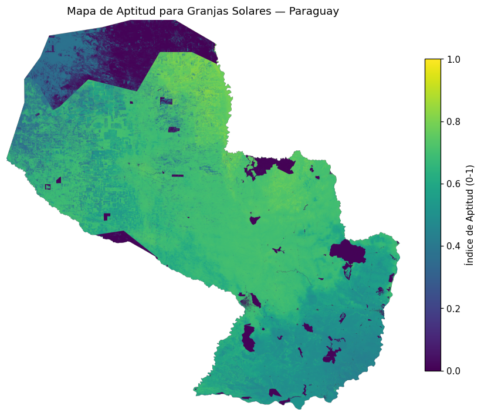

# 🌞 Aptitud Solar Paraguay

Aplicación interactiva (Streamlit) para explorar el mapa de aptitud para granjas solares en Paraguay,
generado con una red neuronal entrenada sobre GHI (Global Solar Atlas), nubosidad, pendiente, uso de
suelo y áreas protegidas (MADES). 

[](HF_SPACE_URL_PLACEHOLDER)



## Modelo

| Modelo | RMSE | MAE | R² |
|---|---|---|---|
| Regresión Lineal | 0.1243 | 0.0978 | 0.7321 |
| Red Neuronal | 0.0532 | 0.0347 | 0.9508 |

Métricas sobre un split de test **espacialmente independiente** (bloques geográficos separados del
entrenamiento), no un split aleatorio por píxel. El GHI usado como input del modelo (Global Solar Atlas)
es una fuente independiente del GHI (NASA-FLDAS) con el que se construyó el índice de aptitud objetivo,
para evitar que el modelo simplemente reconstruya su propia fórmula.

## Correr localmente

```bash
pip install -r requirements.txt
streamlit run app.py
```

## Docker

```bash
docker build -t aptitud-solar .
docker run -p 7860:7860 aptitud-solar
```

Nota: el raster `Mapa_Aptitud_Predicha_NN.tif` (~216MB) no está en este repositorio de GitHub por su
tamaño; se sube directamente al Space de Hugging Face, que sí lo necesita para correr la app en vivo.
